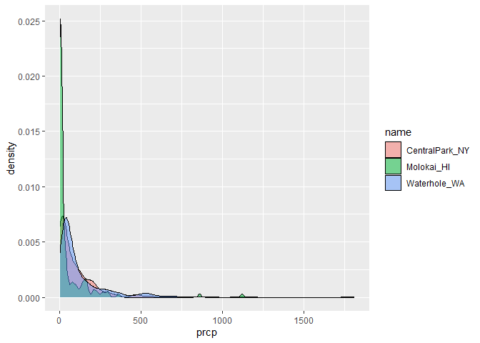
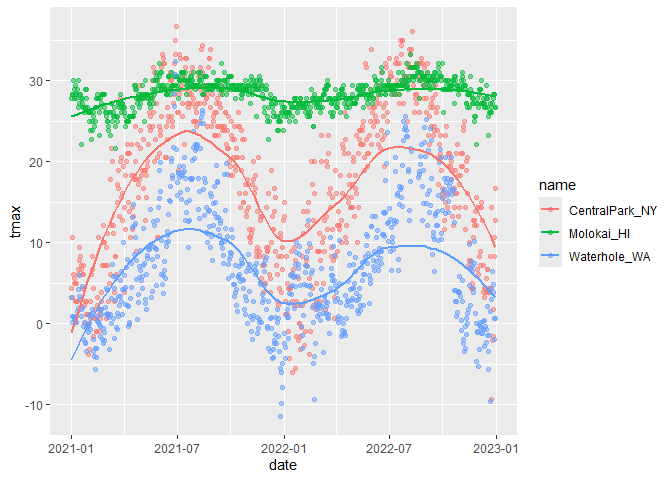
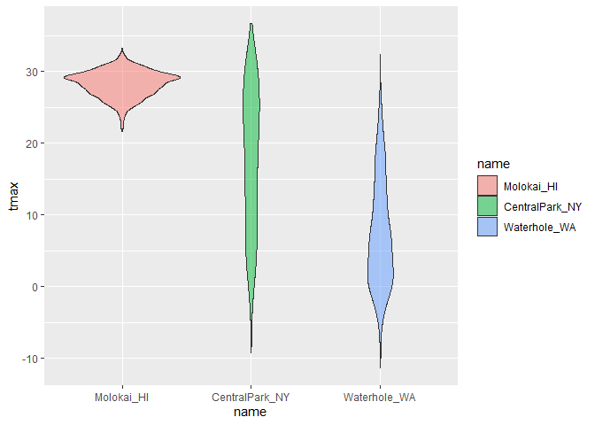

Visualisation and EDA
================

``` r
library(tidyverse)
```

    ## ── Attaching core tidyverse packages ──────────────────────── tidyverse 2.0.0 ──
    ## ✔ dplyr     1.1.4     ✔ readr     2.1.5
    ## ✔ forcats   1.0.0     ✔ stringr   1.5.1
    ## ✔ ggplot2   4.0.0     ✔ tibble    3.3.0
    ## ✔ lubridate 1.9.4     ✔ tidyr     1.3.1
    ## ✔ purrr     1.1.0     
    ## ── Conflicts ────────────────────────────────────────── tidyverse_conflicts() ──
    ## ✖ dplyr::filter() masks stats::filter()
    ## ✖ dplyr::lag()    masks stats::lag()
    ## ℹ Use the conflicted package (<http://conflicted.r-lib.org/>) to force all conflicts to become errors

``` r
library(patchwork)
library(p8105.datasets)
```

``` r
data("weather_df")
```

Let’s make out basic catterplot

``` r
weather_df |>
     ggplot(aes(x = tmin, y = tmax)) + 
     geom_point(aes(color = name), alpha = 0.5) +
     labs(
       x = "Minimum daily temp",
       y = "Maximum daily temp",
       title = "Temperature scatterplot",
       caption = "Data from NOAA"
     )
```

    ## Warning: Removed 17 rows containing missing values or values outside the scale range
    ## (`geom_point()`).

<!-- -->

## Scale

``` r
weather_df |>
     ggplot(aes(x = tmin, y = tmax)) + 
     geom_point(aes(color = name), alpha = 0.5) +
     labs(
       x = "Minimum daily temp",
       y = "Maximum daily temp",
       title = "Temperature scatterplot",
       caption = "Data from NOAA"
     ) +
  scale_x_continuous(
    breaks = c(-20, 0, 25),
    labels = c("-20C", "0", "25")
  ) +
  scale_y_continuous(
    trans = "sqrt",
    limits = c(10, 30)
  )
```

    ## Warning in transformation$transform(x): NaNs produced

    ## Warning in scale_y_continuous(trans = "sqrt", limits = c(10, 30)): sqrt
    ## transformation introduced infinite values.

    ## Warning: Removed 843 rows containing missing values or values outside the scale range
    ## (`geom_point()`).

<!-- -->

``` r
weather_df |>
     filter(tmax > 10, tmax < 30) |> 
     ggplot(aes(x = tmin, y = tmax)) + 
     geom_point(aes(color = name), alpha = 0.5) +
     labs(
       x = "Minimum daily temp",
       y = "Maximum daily temp",
       title = "Temperature scatterplot",
       caption = "Data from NOAA"
     ) +
  scale_x_continuous(
    breaks = c(-20, 0, 25),
    labels = c("-20C", "0", "25")
  ) +
  scale_y_continuous(
    trans = "sqrt",
    limits = c(10, 30)
  )
```

<!-- -->

``` r
weather_df |>
     filter(tmax > 10, tmax < 30) |> 
     ggplot(aes(x = tmin, y = tmax)) + 
     geom_point(aes(color = name), alpha = 0.5) +
     labs(
       x = "Minimum daily temp",
       y = "Maximum daily temp",
       title = "Temperature scatterplot",
       caption = "Data from NOAA"
     ) +
  scale_x_continuous(
    breaks = c(-20, 0, 25),
    labels = c("-20C", "0", "25")
  ) +
  scale_color_hue(h = c(100, 300))
```

<!-- -->

``` r
# change color like this is not good idea to do, do viridis package
```

``` r
library(viridis)
```

    ## Loading required package: viridisLite

``` r
ggp_temp_plot = 
  weather_df |> 
  ggplot(aes(x = tmin, y = tmax)) + 
  geom_point(aes(color = name), alpha = .5) + 
  labs(
    title = "Temperature plot",
    x = "Minimum daily temperature (C)",
    y = "Maxiumum daily temperature (C)",
    color = "Location",
    caption = "Data from the rnoaa package"
  ) + 
  viridis::scale_color_viridis(
    name = "Location", 
    discrete = TRUE
  )
ggp_temp_plot
```

    ## Warning: Removed 17 rows containing missing values or values outside the scale range
    ## (`geom_point()`).

<!-- -->

## Themes

make my base plot

``` r
ggp_temperature = 
  weather_df |> 
  ggplot(aes(x = tmin, y = tmax)) + 
  geom_point(aes(color = name), alpha = .5) + 
  labs(
    title = "Temperature plot",
    x = "Minimum daily temperature (C)",
    y = "Maxiumum daily temperature (C)",
    color = "Location",
    caption = "Data from the rnoaa package"
  ) + 
  viridis::scale_color_viridis(
    discrete = TRUE
  )
ggp_temperature
```

    ## Warning: Removed 17 rows containing missing values or values outside the scale range
    ## (`geom_point()`).

<!-- -->

``` r
ggsave("weather_temperature.png", ggp_temperature)
```

    ## Saving 7 x 5 in image

    ## Warning: Removed 17 rows containing missing values or values outside the scale range
    ## (`geom_point()`).

Update my base plot

``` r
ggp_temperature +
  theme_bw() +
  theme_minimal() +
  theme(legend.position = "bottom")
```

    ## Warning: Removed 17 rows containing missing values or values outside the scale range
    ## (`geom_point()`).

<!-- -->

## Adding data in geoms

``` r
central_park_df =
  weather_df |> 
  filter(name == "CentralPark_NY")

molokai_df =
  weather_df |> 
  filter(name == "Molokai_HI")

ggplot(data = molokai_df, aes(x = date, y = tmax, color = name)) +
  geom_point()
```

    ## Warning: Removed 1 row containing missing values or values outside the scale range
    ## (`geom_point()`).

<!-- -->

``` r
  geom_line(data = central_park_df)
```

    ## geom_line: na.rm = FALSE, orientation = NA, arrow = NULL, arrow.fill = NULL, lineend = butt, linejoin = round, linemitre = 10
    ## stat_identity: na.rm = FALSE
    ## position_identity

## `patchwork`

Make three plots and combine using patchwork

``` r
ggp_tmax_tmin =
  weather_df |> 
  ggplot(aes(x = tmin, y = tmax, color = name)) +
  geom_point(alpha = 0.5)

ggp_prec_density = 
  weather_df |>
  filter(prcp > 0) |> 
  ggplot(aes(x = prcp, fill = name)) + 
  geom_density(alpha = 0.5)
  theme(legend.position = "none")
```

    ## <theme> List of 1
    ##  $ legend.position: chr "none"
    ##  @ complete: logi FALSE
    ##  @ validate: logi TRUE

``` r
ggp_temp_season =
  weather_df |> 
  ggplot(aes(x = date, y = tmax, color = name)) +
  geom_point(alpha = 0.5) +
  geom_smooth(se = FALSE)

ggp_tmax_tmin
```

    ## Warning: Removed 17 rows containing missing values or values outside the scale range
    ## (`geom_point()`).

<!-- -->

``` r
ggp_prec_density
```

<!-- -->

``` r
ggp_temp_season
```

    ## `geom_smooth()` using method = 'loess' and formula = 'y ~ x'

    ## Warning: Removed 17 rows containing non-finite outside the scale range
    ## (`stat_smooth()`).
    ## Removed 17 rows containing missing values or values outside the scale range
    ## (`geom_point()`).

<!-- -->

``` r
(ggp_tmax_tmin + ggp_prec_density)/ggp_temp_season
```

    ## Warning: Removed 17 rows containing missing values or values outside the scale range
    ## (`geom_point()`).

    ## `geom_smooth()` using method = 'loess' and formula = 'y ~ x'

    ## Warning: Removed 17 rows containing non-finite outside the scale range
    ## (`stat_smooth()`).
    ## Removed 17 rows containing missing values or values outside the scale range
    ## (`geom_point()`).

<!-- -->

## Data manipulation

Let’s make temperature violin plots

``` r
weather_df |> 
  ggplot(aes(x = name, y = tmax, fill = name)) + 
  geom_violin(alpha = 0.5)
```

    ## Warning: Removed 17 rows containing non-finite outside the scale range
    ## (`stat_ydensity()`).

<!-- -->
